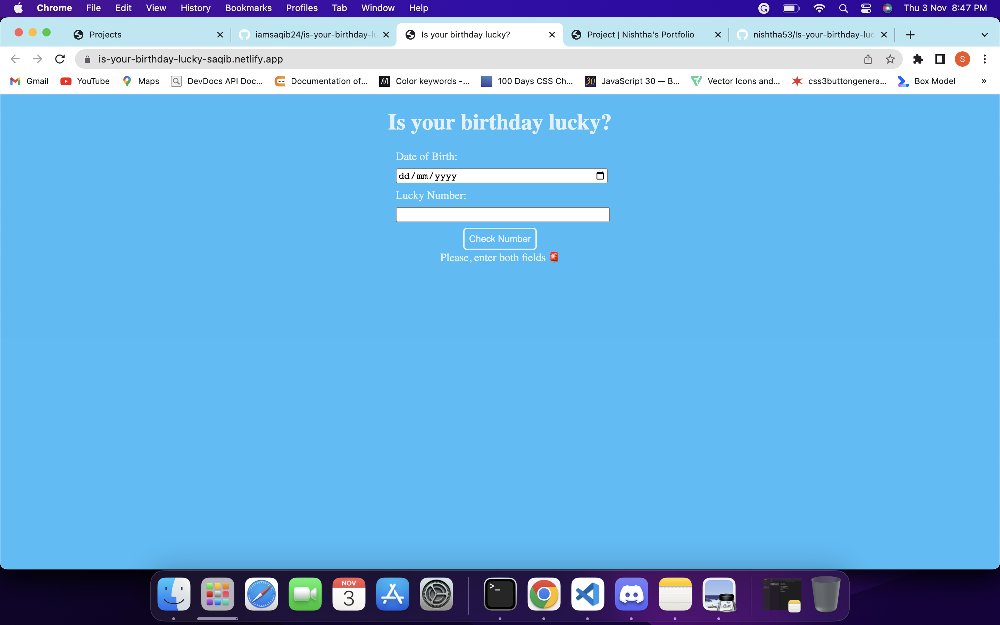

# is-your-birthday-lucky

This was again the fun app which i made using VanillaJS. What it does is, it takes Date of birth of user and ask his lucky number. Then after processing, it will give output whether user is lucky or not.

## Technologies i used to build this:

1. HTML
2. CSS
3. VanillaJS

## Project is live, to check [click here](https://is-your-birthday-lucky-saqib.netlify.app/ "Is your birthday lucky?")

## Image

